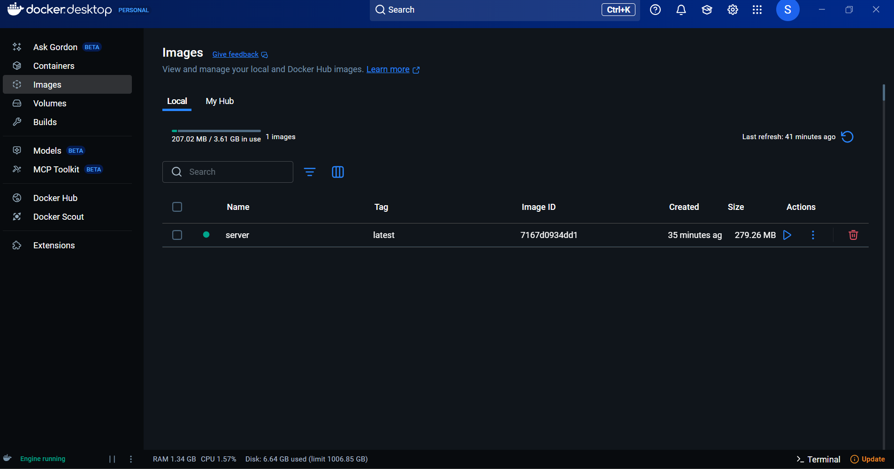
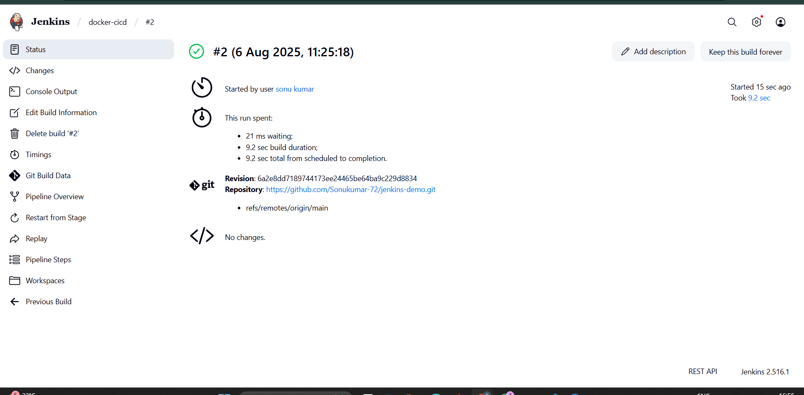
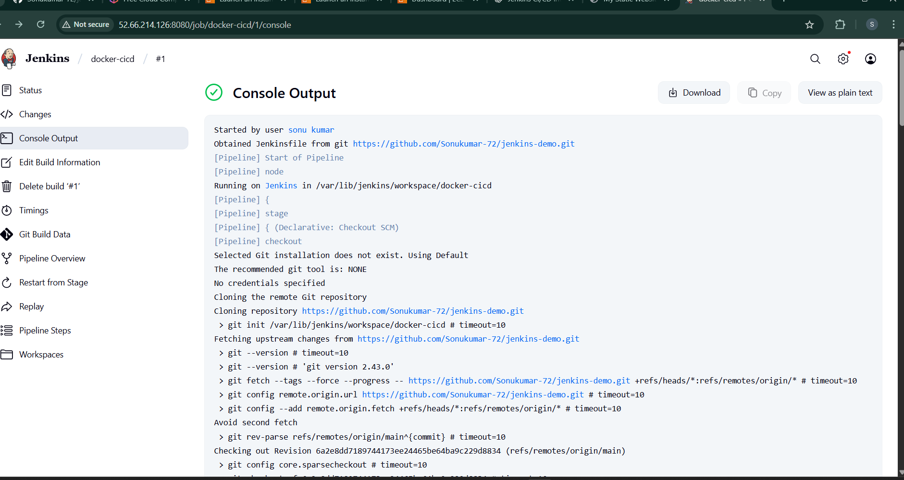

# 🚀 Jenkins CI/CD Pipeline with Docker and GitHub

This project demonstrates a complete CI/CD pipeline using **Jenkins**, **Docker**, and **GitHub**, running on an **Amazon EC2 Linux instance**.

---

## 📌 Table of Contents

- [Introduction](#introduction)
- [Project Objectives](#project-objectives)
- [Prerequisites](#prerequisites)
- [Pipeline Architecture](#pipeline-architecture)
- [Task 1: Static Website in Docker](#task-1-static-website-in-docker)
- [Task 2: Jenkins CI/CD Pipeline](#task-2-jenkins-cicd-pipeline)
- [Setup Guide](#setup-guide)
- [Jenkins Pipeline Code](#jenkins-pipeline-code)
- [Result Screenshots](#result-screenshots)

---

## 🧾 Introduction

This CI/CD pipeline automates the process of building and deploying a static website using Jenkins and Docker. It ensures that any changes pushed to GitHub are automatically deployed to a Docker container running on an EC2 instance.

---

## 🎯 Project Objectives

| Task | Description |
|------|-------------|
| ✅ Task 1 | Create a basic Dockerized static website |
| ✅ Task 2 | Set up a Jenkins pipeline to automate build and deployment using GitHub commits |

---

## ⚙️ Prerequisites

- EC2 Amazon Linux instance
- Jenkins installed and running
- Docker installed and running
- Git installed
- GitHub repository with:
  - `index.html`
  - `Dockerfile`
  - `Jenkinsfile` (optional)
- Jenkins configured with GitHub Webhook and credentials

---

## 📊 Pipeline Architecture


---

## 🧪 Task 1: Static Website in Docker

- Created a simple HTML website.
- Dockerized using NGINX and built with `Dockerfile`.
- Exposed via port 8080 on the host.
- Successfully accessed using: `http://localhost:8080/index.html`

### ✅ Proof:




---

## 🔁 Task 2: Jenkins CI/CD Pipeline

- Configured a **Freestyle Project** in Jenkins.
- Connected GitHub repo via webhook.
- On each push, Jenkins:
  - Checks if a container is running.
  - If running, it copies the updated files into it.
  - Else, it builds a Docker image and starts a new container.

### ✅ Jenkins Build Success:




---

## 📥 Setup Guide

### 🔧 Install Jenkins

```bash
sudo yum update -y
sudo wget -O /etc/yum.repos.d/jenkins.repo https://pkg.jenkins.io/redhat-stable/jenkins.repo
sudo rpm --import https://pkg.jenkins.io/redhat-stable/jenkins.io-2023.key
sudo yum upgrade
sudo amazon-linux-extras install java-openjdk11 -y   # or for Amazon Linux 2023:
sudo dnf install java-11-amazon-corretto -y
sudo yum install jenkins -y
sudo systemctl enable jenkins
sudo systemctl start jenkins
